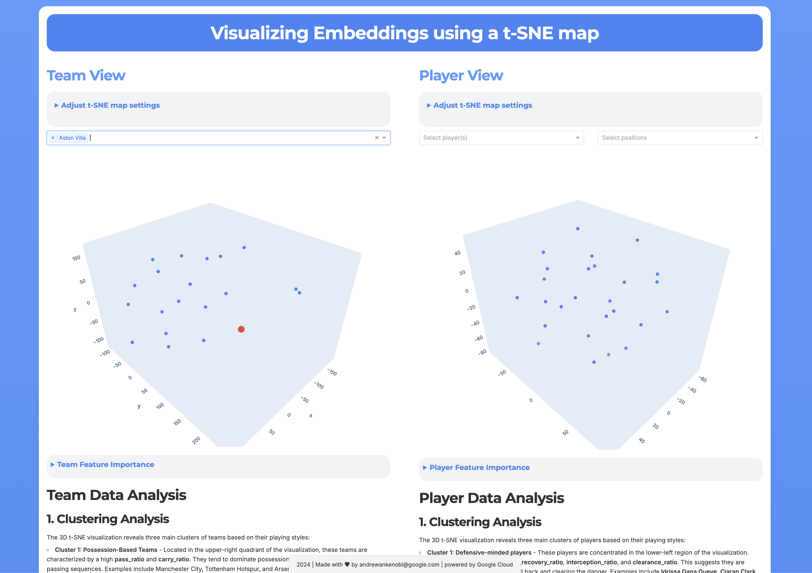

# StatsBomb Data Analysis Hackathon


This repository contains the necessary code and instructions to run a data analysis hackathon using StatsBomb open data and Google Cloud Platform (GCP) services.

## Prerequisites

- Python 3.7+
- Google Cloud SDK
- A Google Cloud Platform account with billing enabled

## Setup

1. **Clone this repository:**   ```
   git clone https://github.com/andrewankenobi/football_hackathon.git
   cd football_hackathon   ```

2. **Install the Google Cloud SDK:**
   - Download the Google Cloud SDK from [https://cloud.google.com/sdk/docs/install](https://cloud.google.com/sdk/docs/install).
   - Follow the instructions for your operating system to install the SDK.

3. **Install the required Python dependencies:**   ```
   pip install -r requirements.txt   ```

4. **Create a GCP project:**
   - Go to the [Google Cloud Console](https://console.cloud.google.com/).
   - Click on the "Select a project" dropdown in the top left corner and click "Create project".
   - Enter a project name and click "Create".

5. **Set your GCP project:**
   - Run the following command to set your GCP project:   ```
   gcloud config set project <your-project-id>   ```
   - Replace `<your-project-id>` with the ID of your Google Cloud project.

6. **Authenticate with your Google Cloud account:**
   - Open a terminal or command prompt.
   - Run the following command:   ```
   gcloud auth application-default login   ```
   - This will open a browser window where you can select your Google Cloud account and grant access to the SDK.

7. **Enable required Google Cloud APIs:**
   - Run the following commands to enable the necessary APIs for this project:   ```
   gcloud services enable bigquery.googleapis.com bigqueryconnection.googleapis.com aiplatform.googleapis.com storage.googleapis.com cloudresourcemanager.googleapis.com appengine.googleapis.com ```

   Note: It may take a few minutes for each API to be fully enabled. You can check the status of the APIs in the Google Cloud Console under "APIs & Services" > "Dashboard".

## Data Download and Loading

1. **Download the StatsBomb data:**
   - Run the data download script:   ```
   python download_statsbomb_data.py   ```
   - This script will download JSON files from the StatsBomb open data repository. You can choose which competitions and seasons to download.
   - Alternatively, you can use the pre-downloaded Premier League data in the `data` folder.

2. **Load the data into BigQuery:**
   - Create a BigQuery dataset in your project:   ```
   bq mk --dataset <your-project-id>:statsbomb --location=us-central1   ```
   - Replace `<your-project-id>` with your project ID.
   - Run the following command to load the downloaded data into BigQuery:   ```
   python load_to_bigquery.py <your-project-id> statsbomb   ```

## Vertex AI Connection Setup

1. **Create a connection to Vertex AI in BigQuery:**
   - Make sure it's in the same location as your dataset.
   - Run the following command:   ```
   bq mk --connection --display_name="gemini-connection" --connection_type=CLOUD_RESOURCE --project_id=<your-project-id> --location=us-central1 gemini-connection   ```
   - Replace `<your-project-id>` with your project ID and `<your-location>` with the location of your BigQuery dataset (e.g., `us-central1`).

2. **Grant the Vertex AI User role to the service account associated with the connection:**
   - Run the following command:   ```
   gcloud projects add-iam-policy-binding <your-project-id> --member="serviceAccount:<service-account-email>" --role="roles/aiplatform.user"   ```
   - Replace `<your-project-id>` with your project ID and `<service-account-email>` with the email of the service account created for the connection. You can find the service account email in the BigQuery console under the "External connections" tab.

## Running Queries and Experiments

The `sql_queries.sql` file contains a comprehensive set of SQL queries, views, and machine learning models that you can use to analyze the StatsBomb data. Let's walk through some of the key examples:

1. **Schema Evaluation:**

   - The `vw_schema_info` view provides a comprehensive overview of the schema of all tables in the StatsBomb dataset. You can use this view to understand the structure of the data and identify the columns available for analysis.
   - Run the following query in BigQuery:   ```sql
   SELECT * FROM `statsbomb.vw_schema_info` LIMIT 10;   ```

2. **Data Exploration Views:**

   - **`vw_goals_by_body_part`:** This view analyzes goals scored by different body parts for each player and team. It helps you understand how players score goals and identify any trends in goal-scoring techniques.
   - Run the following query in BigQuery:   ```sql
   SELECT * FROM `statsbomb.vw_goals_by_body_part` LIMIT 10;   ```

   - **`vw_top_scorers`:** This view ranks players by the number of goals scored. It's a simple but effective way to identify the most prolific goal-scorers in the dataset.
   - Run the following query in BigQuery:   ```sql
   SELECT * FROM `statsbomb.vw_top_scorers` LIMIT 10;   ```

   - **`vw_team_possession`:** This view calculates average possession percentages for each team. It provides insights into how teams control the ball and their overall style of play.
   - Run the following query in BigQuery:   ```sql
   SELECT * FROM `statsbomb.vw_team_possession` LIMIT 10;   ```

3. **Player Analysis:**

   - **`vw_player_stats`:** This view provides comprehensive statistics for each player, including the number of passes, shots, ball recoveries, duels, interceptions, and more. It's a valuable resource for understanding player performance and identifying key strengths and weaknesses.
   - Run the following query in BigQuery:   ```sql
   SELECT * FROM `statsbomb.vw_player_stats` LIMIT 10;   ```

   - **`vw_player_shots`:** This view analyzes player shots in detail, including shot type, body part, technique, location, and whether the shot resulted in a goal. It's useful for analyzing shot quality and identifying patterns in goal-scoring.
   - Run the following query in BigQuery:   ```sql
   SELECT * FROM `statsbomb.vw_player_shots` LIMIT 10;   ```

4. **Match Analysis:**

   - **`vw_match_stats`:** This view generates comprehensive match statistics, including possession percentages, shots, goals, passes, fouls, duels, and expected goals (xG). It provides a rich dataset for analyzing match outcomes and identifying key factors that influence the result.
   - Run the following query in BigQuery:   ```sql
   SELECT * FROM `statsbomb.vw_match_stats` LIMIT 10;   ```

5. **Advanced Analytics and Machine Learning Models:**

   - **`player_clusters`:** This model uses K-means clustering to group players based on their performance statistics. It helps you identify groups of players with similar playing styles and characteristics.
   - Run the following query in BigQuery to get predictions from the model:   ```sql
   SELECT * FROM ML.PREDICT(MODEL `statsbomb.player_clusters`, (SELECT * FROM `statsbomb.vw_player_stats`)) LIMIT 10;   ```

   - **`xg_prediction`:** This model predicts the probability of a shot resulting in a goal based on various factors such as shot type, body part, technique, and location. It's a powerful tool for evaluating shot quality and understanding the likelihood of a shot being converted into a goal.
   - Run the following query in BigQuery to get predictions from the model:   ```sql
   SELECT * FROM ML.EXPLAIN_PREDICT(MODEL `statsbomb.xg_prediction`, (SELECT shot.type.name AS shot_type, shot.body_part.name AS body_part, shot.technique.name AS technique, under_pressure, play_pattern.name, location FROM `statsbomb.events` WHERE type.name = 'Shot' LIMIT 10));   ```

   - **`goal_prediction_model`:** This model predicts whether a shot will result in a goal based on features from the `vw_player_shots` view. It's useful for identifying shots that are more likely to be successful and for understanding the factors that contribute to goal-scoring.
   - Run the following query in BigQuery to get predictions from the model:   ```sql
   SELECT * FROM ML.PREDICT(MODEL `statsbomb.goal_prediction_model`, (SELECT * FROM `statsbomb.vw_player_shots` LIMIT 10));   ```

   - **`match_outcome_prediction`:** This model predicts the outcome of a match (home win, away win, or draw) based on in-game statistics from the `vw_match_stats` view. It's a valuable tool for predicting match results and for understanding the factors that influence match outcomes.
   - Run the following query in BigQuery to get predictions from the model:   ```sql
   SELECT * FROM ML.PREDICT(MODEL `statsbomb.match_outcome_prediction`, (SELECT * FROM `statsbomb.vw_match_stats` LIMIT 10));   ```

6. **Player Embeddings and Similarity Search:**

   - The `player_embeddings` table contains embeddings for each player, generated using a PCA model. These embeddings can be used to find players with similar characteristics.
   - Run the following query in BigQuery to find players similar to Petr Čech:   ```sql
   SELECT base.* FROM VECTOR_SEARCH(TABLE `statsbomb.player_embeddings`, 'ml_generate_embedding_result', (SELECT ml_generate_embedding_result FROM `statsbomb.player_embeddings` WHERE player_name = 'Petr Čech'), top_k => 10, distance_type => 'COSINE') WHERE base.player_name != 'Petr Čech';   ```

## Model Registration with Vertex AI

After creating the machine learning models in BigQuery, we register them with Vertex AI for easier management and deployment. This step is crucial for integrating our models with other GCP services and making them accessible through Vertex AI's interface.

The following models are registered with Vertex AI:

1. Player Clustering Model
2. Expected Goals (xG) Prediction Model
3. Goal Prediction Model
4. Match Outcome Prediction Model

The registration process is automated in the `sql_queries.sql` file using the `ALTER MODEL` statement. Here's an example of how it's done:

```sql
ALTER MODEL IF EXISTS `statsbomb.player_clusters` 
SET OPTIONS (vertex_ai_model_id="statsbomb_player_clusters");
```

This statement registers the `player_clusters` model with Vertex AI under the ID "statsbomb_player_clusters".

To execute these registration statements:

1. Ensure you have the necessary permissions to alter models and interact with Vertex AI.
2. Run the `sql_queries.sql` script in its entirety, or execute the `ALTER MODEL` statements individually.

After registration, you can manage and deploy these models through the Vertex AI console or API, enabling integration with other GCP services and facilitating model serving and monitoring.

Note: Make sure your BigQuery connection to Vertex AI is properly set up before running these registration commands.

## Deploying and Testing the Match Outcome Prediction Model

After registering the models with Vertex AI, you can deploy them to endpoints for real-time predictions. Here's how to deploy and test the `statsbomb_match_outcome_prediction` model:

1. Deploy the model to a Vertex AI endpoint (this process may take up to 10 minutes):

   ```
   gcloud ai models deploy statsbomb_match_outcome_prediction \
     --region=us-central1 \
     --display-name=statsbomb_match_outcome_prediction \
     --container-image-uri=us-docker.pkg.dev/vertex-ai/prediction/tf2-cpu.2-12:latest
   ```

   Note: Replace `us-central1` with your preferred region if different.

2. Once the deployment is complete, you can test the model using the following JSON payload:

   ```json
   {
     "instances": [
       {
         "period": 2,
         "minute": 75,
         "second": 30,
         "home_team": "Manchester United",
         "away_team": "Liverpool",
         "score_difference": 1,
         "home_possession_percentage": 0.52,
         "home_shots": 12,
         "away_shots": 10,
         "home_goals": 2,
         "away_goals": 1,
         "home_passes": 450,
         "away_passes": 400,
         "home_fouls": 8,
         "away_fouls": 10,
         "home_duels": 30,
         "away_duels": 28,
         "home_avg_xg": 0.12,
         "away_avg_xg": 0.09,
         "shot_difference_per_minute": 0.027,
         "pass_difference_per_minute": 0.667,
         "foul_difference_per_minute": -0.027,
         "duel_difference_per_minute": 0.027,
         "xg_difference": 0.03
       }
     ],
     "parameters": {
       "confidence_threshold": 0.5
     }
   }
   ```

3. Use the following curl command to test the deployed model (replace `[ENDPOINT_ID]` and `[PROJECT_ID]` with your actual values):

   ```
   curl -X POST \
     -H "Authorization: Bearer $(gcloud auth print-access-token)" \
     -H "Content-Type: application/json" \
     https://us-central1-aiplatform.googleapis.com/v1/projects/[PROJECT_ID]/locations/us-central1/endpoints/[ENDPOINT_ID]:predict \
     -d @request.json
   ```

   Note: Save the JSON payload in a file named `request.json` before running this command.

This will send a prediction request to your deployed model and return the predicted match outcome based on the provided in-game statistics.

## Running t-SNE Visualization Locally

After completing the setup and data loading steps, you can run the t-SNE visualization locally:

1. Ensure you have all the required dependencies installed (step 2 in the Setup section).

2. Run the t-SNE visualization script:
   ```
   python tsne.py
   ```

3. Open a web browser and navigate to the URL displayed in the console (typically http://127.0.0.1:8080/).

This command will start a local Dash server and display an interactive t-SNE visualization of player embeddings. Once launched, open your default web browser and navigate to the provided URL (typically http://127.0.0.1:8050/). You will be presented with an interface similar to the following:



## Deploying to Google App Engine

After testing the t-SNE visualization locally, you can deploy it to Google App Engine for public access. Follow these steps:

1. Ensure you have the Google Cloud SDK installed and you're authenticated with your Google Cloud account.

2. Make sure you're in the project directory containing `app.yaml`, `tsne.py`, and other necessary files.

3. If you haven't already, create an `app.yaml` file with the following content:
   ```yaml
   runtime: python39
   service: tsne
   entrypoint: gunicorn -b :$PORT tsne:server

   instance_class: F2

   automatic_scaling:
     target_cpu_utilization: 0.65
     min_instances: 0
     max_instances: 3   ```

4. Create a `.gcloudignore` file to specify which files should not be uploaded to App Engine. Here's a sample:
   ```
   # Python pycache:
   __pycache__/
   # Ignored by the build system
   /setup.cfg
   # Ignore git and IDE files
   .git
   .gitignore
   .idea
   .vscode
   # Ignore data, docs, notebooks, and tests directories
   /data/
   /docs/
   /notebooks/
   /tests/
   # Ignore markdown and text files
   *.md
   *.txt
   !requirements.txt
   # Ignore YAML files (except app.yaml)
   *.yaml
   *.yml
   !app.yaml
   # Ignore JSON files
   *.json
   # Ignore Dockerfile
   Dockerfile
   # Ignore backup files
   *.bak
   # Ignore Python compiled files
   *.pyc
   *.pyo
   *.pyd   ```

5. Deploy the application to App Engine using the following command:
   ```
   gcloud app deploy
   ```

6. When prompted, select the region where you want to deploy your app.

7. The deployment process will begin. This may take a few minutes.

8. Once the deployment is complete, you can view your application by running:
   ```
   gcloud app browse   
   ```

   This will open your default web browser with the URL of your deployed application.

Your t-SNE visualization is now deployed on Google App Engine and accessible via the provided URL. You can share this URL with others who want to explore the visualization.

Note: Make sure your Google Cloud project has billing enabled and the necessary APIs (like App Engine) activated. Also, be aware that running applications on App Engine may incur charges to your Google Cloud account.

## Project Structure

- `data/`: Contains pre-downloaded Premier League data
- `doc/`: Documentation files, including StatsBomb event specifications
- `sql_queries.sql`: Sample SQL queries for data analysis
- `load_to_bigquery.py`: Script to load data into BigQuery
- `requirements.txt`: List of Python dependencies
- `statsbomb_schema.json`: JSON schema for StatsBomb data
- `tsne-players.py`: Script for t-SNE visualization of player embeddings

## Resources

- [StatsBomb Open Data](https://github.com/statsbomb/open-data)
- [Google Cloud Documentation](https://cloud.google.com/docs)
- [BigQuery ML Documentation](https://cloud.google.com/bigquery-ml/docs)
- [Vertex AI Documentation](https://cloud.google.com/vertex-ai/docs)

## Support

If you encounter any issues or have questions, please open an issue in this repository.

Happy hacking!
